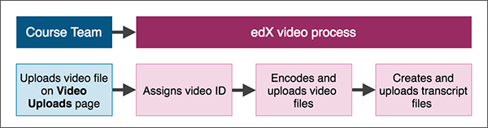
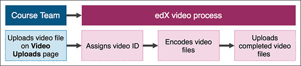

.. _Upload a Video on edX:

#################
Uploading a Video
#################

Uploading a video and transcript is different depending on whether your course is on edx.org or Edge.

For edx.org courses, the process is also different depending on whether your
course uses :ref:`integrated transcripts <Integrated Transcripts>` or
:ref:`non-integrated transcripts <Non Integrated Transcripts>`.

.. contents::
  :local:
  :depth: 2

.. _Uploading a Video for an edx org Course:

******************************************
Uploading a Video for an edx.org Course
******************************************

.. note::
  **This information applies only to courses that run on the edx.org site.**
  For information about adding video files to courses that run on Edge,
  see :ref:`Uploading a Video for an Edge Course`.

So that the edX video player can automatically play videos in the best format
for a learner's device and internet connection, after you upload a video for an
edx.org course, an automated video process creates multiple formats and sources
for every video. The process also assigns a single video ID to the video that
represents all of the formats and hosting locations for the video.

* For courses that have :ref:`integrated transcripts <Integrated Transcripts>`
  through 3Play Media or cielo24, the edX automated video process also creates
  transcripts for each video.

* For courses that have :ref:`non-integrated transcripts <Non Integrated
  Transcripts>`, the course team must upload video transcripts manually.

For more information, see :ref:`Automated Video Process for Integrated
Transcripts` or :ref:`Automated Video Process for Non Integrated Transcripts`.

.. _Automated Video Process for Integrated Transcripts:

========================================================
Automated Video Process for Integrated Transcripts
========================================================

If the course has integrated video transcripts through 3Play Media or cielo24,
the process has the following steps.

.. note::
  If a step does not complete successfully, the process automatically tries
  again multiple times.

     detailed in the following numbered list.

#. The course team uploads the video file on the **Video Uploads** page.
#. The process assigns a unique video ID to the video. This video ID represents
   all of the files, hosting locations, and transcripts that the automated
   process creates.
#. The process encodes video files in different formats.
#. The process creates transcripts for the video.
#. The process uploads the video files and transcripts to the hosting service.

.. important::
  As soon as the automated video process has assigned a video ID to the video,
  you can add the video to the course. However, the video is not visible in the
  course until the automated process is complete. The process can take up to 24
  hours.

.. _Automated Video Process for Non Integrated Transcripts:

========================================================
Automated Video Process for Non-Integrated Transcripts
========================================================

If the course uses a transcript provider that does not offer integrated
transcripts, the video processing service completes the following steps.

     detailed in the following numbered list.

#. The course team uploads the video file on the **Video Uploads** page.
#. The process assigns a unique video ID to the video. This video ID represents
   all of the files and hosting locations that the automated process creates.
#. The process encodes video files in different formats.
#. The process uploads the video files to the hosting service.
#. The course team must manually obtain and upload video transcripts. For more
   information, see :ref:`Obtain a Video Transcript`.

.. important::
  As soon as the automated video process has assigned a video ID to the video,
  you can add the video to the course. However, the video is not visible in the
  course until the automated process is complete. The process can take up to 24
  hours.

If a step does not complete successfully, the process automatically tries again
multiple times.

====================================
Upload a Video for an edx.org Course
====================================

To upload video files, both for videos with integrated transcripts and non-
integrated transcripts, follow these steps.

.. important::
  You must leave the **Video Uploads** page open in your browser until the
  upload process is complete for all files.

#. Open the course in Studio.
#. On the **Content** menu, select **Video Uploads**.
#. Add video files to the **Video Uploads** page. You can drag files to the
   page and drop them, or select **Browse your computer** to locate the files
   to upload.

   A rectangular tile appears on the page for each file and shows the following
   information.

   * The video file name.
   * A progress bar.
   * The status of the file upload process.

   When the file has been successfully uploaded, the tile disappears, and an
   entry for the video appears under **Previous Uploads** with a status of
   “Uploaded”.

#. (optional) Specify a thumbnail image for the video. The thumbnail image is
   the image that learners see before the video begins to play. To do this,
   hover the cursor over **Add Thumbnail**, select an image from your computer,
   and then select **Open**.

   If a thumbnail image exists for the video and you want to change the image,
   hover the cursor over the image, and then select **Edit Thumbnail**. Select
   an image from your computer, and then select **Open**.

After you have uploaded video files, the edX video process begins. You can
check the progress of a video file through the service at any time. For more
information, see :ref:`Monitor Video Processing` and :ref:`Reporting Video
Status`.

.. _Monitor Video Processing:

========================
Monitor Video Processing
========================

After your video files are successfully uploaded, the video processing service
begins.

.. note::
  This service takes up to 24 hours to complete.

A list of every file that you attempt to upload to the edX servers appears in
the **Previous Uploads** section of the **Video Uploads** page. The list
includes each file's status in the encoding and hosting workflow. In addition,
you can download a report of the video files that you uploaded. For more
information, see :ref:`Reporting Video Status`.

.. _Video Processing Statuses:

===========================
Video Processing Statuses
===========================

The encoding and hosting process assigns the following statuses to video files.

* **Failed** files did not complete processing successfully. Verify that you
  can play your original .mp4 or .mov file and that it meets the other
  specifications for successful video processing. Then upload the file, or a
  replacement file, again. If processing fails more than once for a file,
  contact edX partner support at ``partner-support@edx.org``.

  For more information, see :ref:`Compression Specifications`.

* **Failed Duplicate** is the status for files that failed to upload because
  the system identified the files as duplicates.

* **In Progress** files are undergoing processing to create additional file
  formats or waiting for successful transfer to the host sites.

* **Invalid Token** indicates a configuration problem. If this status appears,
  contact edX partner support at ``partner-support@edx.org``.

* **Ready** files are ready for inclusion in your course and for learners to
  view.  When you click the names of these files, a file hosted on one of the
  external host sites plays. Processing continues at video hosting sites for 24
  hours after you upload a file.

  For more information, see :ref:`Add a Video to a Course`.

* **Unknown** indicates a configuration problem. If this status appears,
  contact edX partner support at ``partner-support@edx.org``.

* **Uploaded** files have successfully completed uploading to the edX servers.

* **Uploading** files have not yet reached the edX servers successfully. For
  files that encounter a problem, verify that the file that you uploaded is in
  .mp4 or .mov format and meets the other specifications for successful video
  processing. Then try uploading the file (or its replacement) again.

  For more information, see :ref:`Video Guidelines`.

.. _Reporting Video Status:

==========================================
Downloading the Available Encodings Report
==========================================

The Available Encodings report is a comma separated values (.csv) file that
provides detailed information about the video files that you have uploaded.
This report includes the status of the encoding and hosting process for each
video file that you have uploaded, the identifier for the video, and the URLs
for each encoding format. The edX encoding and hosting process produces these
alternative formats to ensure optimal playback quality for your learners.

You can view the Available Encodings report in a spreadsheet application or
text editor.

To download the Available Encodings report, follow these steps.

#. Open the course in Studio.

#. On the **Content** menu, select **Video Uploads**.

#. On the **Video Uploads** page, click **Download available encodings
   (.csv)**.

#. Use a spreadsheet application or text editor to open the .csv file.

The .csv file includes the following columns.

* The file **Name**.

* The file **Duration**. If the upload process has not yet determined how long
  the file is, **Pending** appears in the **Duration** column for a video.

* The **Date Added**, which shows the date and time that you uploaded the
  video file.

* The unique, identifying **Video ID**. When you add a video component to your
  course, you supply the video ID for the file you want to add. See
  :ref:`Add a Video to a Course`.

* The **Status** of the encoding and hosting process for the file. See
  :ref:`Video Processing Statuses`.

The .csv file also includes a column for each of the formats that are the
result of the edX encoding and hosting process. These columns include the URL
of a host site only after the format is successfully generated and delivered to
its destination.

* **desktop_mp4 URL**: The location of a 720p resolution video file in mp4
  format. This file is delivered to learners who view course videos with mp4
  players.

* **desktop_webm URL**: The location of a 720p resolution video file in webm
  format. This file is delivered to learners who view course videos with webm
  players.

  .. note::
    The encoding and hosting process no longer creates webm versions of the
    video files that you upload. Modern web browsers do not require the webm
    format. The .csv file includes the **desktop_webm URL** column to show the
    webm URLs for videos uploaded before this change. When you upload a new
    video, the column will remain empty, even after the encoding and hosting
    process is complete.

* **mobile_low URL**: The location of a 360p resolution video file. This
  file is delivered to learners who download and view course videos on mobile
  devices.

* **youtube URL**: EdX no longer supports YouTube videos.

.. _Delete Videos from Upload Page:

=========================================
Remove Videos from the Video Uploads Page
=========================================

A list of every file that has been uploaded to the edX servers appears in the
**Previous Uploads** section of the **Video Uploads** page. You can remove
videos from the **Previous Uploads** list without affecting course content
that uses the video ID of successfully uploaded videos.

To remove a video from the **Previous Uploads** list, follow these steps.

#. Open the course in Studio.

#. On the **Content** menu, select **Video Uploads**.

#. In the **Previous Uploads** list, locate the row for the video that you
   want to remove, then select the "X" icon in the **Action** column.

#. In the confirmation dialog box that appears, select **Remove** to remove
   the video.

The selected video is removed from the **Previous Uploads** list. Course
content that uses the video ID of the removed video is not affected.

.. _Uploading a Video for an Edge Course:

******************************************
Uploading a Video for an Edge Course
******************************************

.. note::
  This information applies only to courses that run on Edge. For information
  about uploading videos to courses that run on edx.org, see
  :ref:`Uploading a Video for an edx org Course`.

.. include:: ../../../shared/video/upload_video.rst
