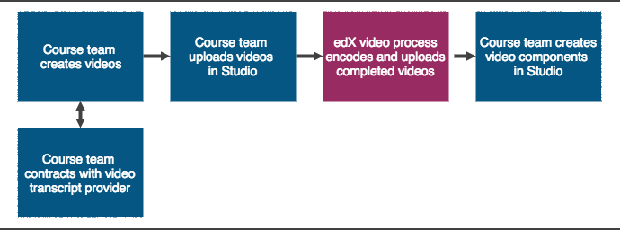

.. _Video Process Overview:

####################################
Video Process Overview
####################################

The video process is different for courses on edx.org and courses on Edge.

************************************
Video Process for Courses on edx.org
************************************

The following diagram outlines the general process for adding videos to an
edx.org course.

      following numbered steps.

#. The course team prepares to add videos to the course. These steps can happen
   simultaneously.
   * The course team creates videos.
   * The course team or organization contracts with 3Play Media, cielo24, or
     another third party transcript provider.
#. The course team uploads a video to the Video Uploads page.
#. The edX video process encodes and uploads completed videos to the edX
   hosting service.
#. The course team creates video components and adds the video information to
   the components.

The specific process is different depending on your transcript provider. For
more information, see :ref:`Add a video with integrated transcripts to a
course` or :ref:`Add a video with non integrated transcripts to a course`.

************************************
Video Process for Courses on Edge
************************************

.. include:: ../../../shared/video/video_process_overview.rst

