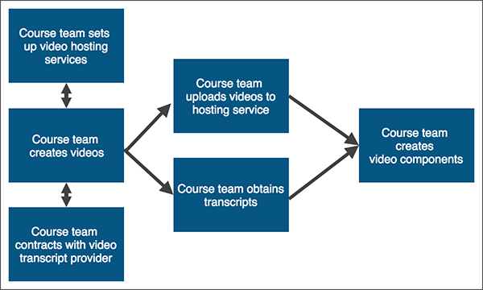

.. only:: Partners

    The following diagram outlines the general process for adding videos to an
    Edge course.

.. only:: Open_edX

    The following diagram outlines the general process for adding videos to a
    course.

      numbered steps.

#. The course team prepares to add videos to the course. These steps can happen
   simultaneously.
   * The course team sets up video hosting services.
   * The course team creates videos.
   * The course team contracts with 3Play Media, cielo24, or another third
     party transcript provider.
#. The course team uploads videos and transcripts. These steps can happen
   simultaneously.
   * The course team uploads the videos to the Video Uploads page.
   * The course team uploads the transcripts to the Files & Uploads page.
#. The course team creates video components and adds the video information to
   the components.

